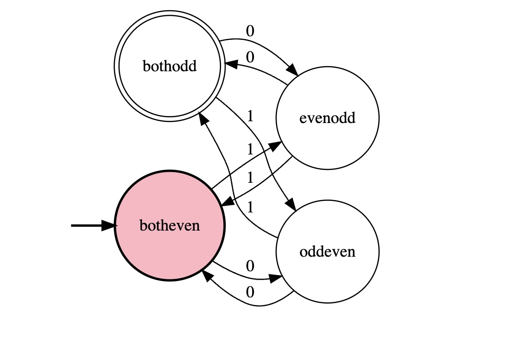
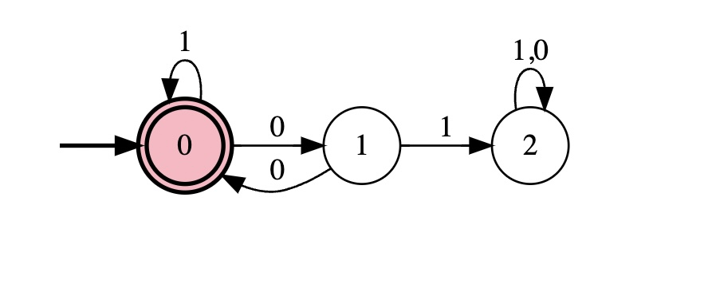
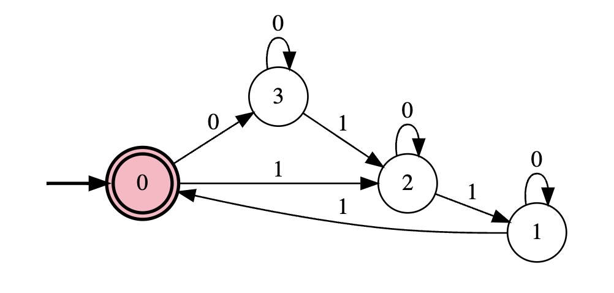

Part 1: Defining the Finite Automata 

The finite automata is defined by the following data structure: 
`S = {0, 1}, L = { w = strings of S* such that count(0) % 2 == 1 and count(1) % 2 == 1 }`

Part 2: How to run Code 
`make` 
`./automata` 
`make clean`

Part 3: Practice Constructing Finite State Machines 
The following finite state machines are constructed by the following data structures: 
`S = {0, 1}, L = { w = strings of S* such that the character 0 always appears in pairs }`

The following finite state machines are constructed by the following data structures: 
`S = {0, 1}, L = { w = strings of S* such that the count of the character 1 is a multiple of 3 }`

Part 4: Limitation of Finite automata 
We can't construct a finite automatat that balances parentheses. This is because the number of open and close parentheses can be equal, but the order of the parentheses can be wrong. For example, the string `(()))` is not balanced, but the number of open and close parentheses are equal. This is a limitation because there is no variables to store the order of the parentheses.

README Questions:
1. Create 3 finite state machines for three different objecives, turned the first one into c++ code and answered the limitations of finite automata question. No concerns.
2. No questions
3. N/A
4. Wrote the c++ code by myself and created the three finte machines by myself.
5. This took about an hour to complete.
6. It was fine
7. I would give myself a 100%.
8. N/As